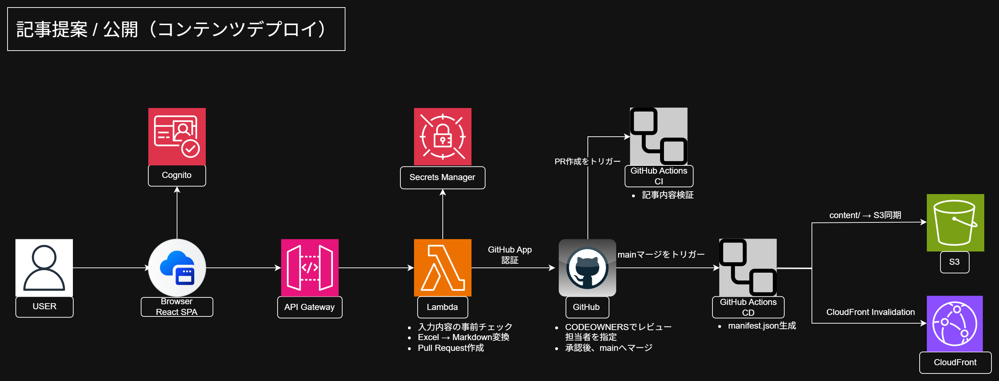
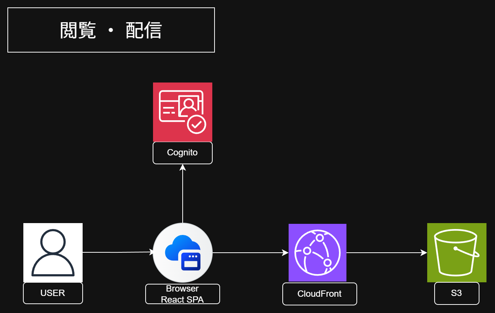
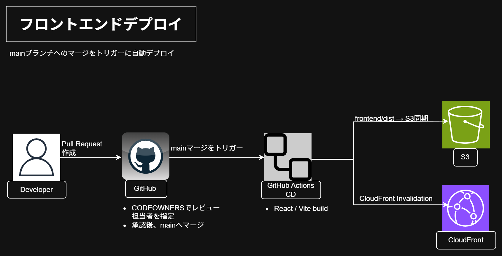

# Synapush (シナプッシュ)

社内の公式ナレッジと個人のナレッジを、同じ場所で公開・共有できる社内向けナレッジアプリです。  
Push操作で脳のシナプスを繋ぐイメージから、社内の「知見の森」を作るナレッジベースとして Synapush と名付けました。

- デモURL：<https://d1ilmqsa5e6ydq.cloudfront.net>
- ゲストログイン：ワンクリックログインボタンを実装済（閲覧専用アカウントとしてログイン可能）

---

## 制作背景

前職の製造現場で感じていた課題をもとに、「こういう仕組みがあれば使いたかった」と思うアプリと、それを運用するためのインフラをポートフォリオとして作成しました。

現場では、ベテラン社員が持っている知見が本人の頭の中にあり、人から人へ教えていく中で内容が少しずつ変わる、いわゆる属人化や伝言ゲームのような状態になることがありました。  
そこで、公式ナレッジと個人ナレッジを一か所に集約し、社員が必要な情報へアクセスしやすいナレッジ基盤を作れないかと考えました。

開発時は、製造業の現場管理・監督業務に携わる中で、リスクアセスメントや部下育成時の実務知見をサンプルデータとして使い、実際の現場運用を想定して検証しながら作りました。（300名規模を想定）

## 解決したい課題

- 公式ナレッジや個人ナレッジが別々の場所や個人の頭の中に散らばっているため、一か所に集約する
- 公式ナレッジと個人ナレッジは性質が違うため、混同せず区別して管理する
- ナレッジの提案自体は全社員ができるようにしつつ、公開時には責任者の承認を必須にして情報の信頼性を維持する
- GitHubを扱わない社員が多いことを想定し、GitHubを直接操作しなくてもアプリ内から提案を完了できるようにする

### ナレッジの定義

- 公式：社内標準、方案書などの社内文書や、法令・指針に基づく会社として管理する知見・規定
- 個人：個人の経験やノウハウから得られた知見。組織内で共有・活用し、内容によっては公式ナレッジへの提案につなげることも想定

## 使用技術

| 分類 | 技術 |
| --- | --- |
| フロントエンド | React / TypeScript / Vite |
| 認証 | Cognito（アプリ側ゲート方式） |
| ストレージ | S3 |
| 配信 | CloudFront |
| 提案受付API | API Gateway + Lambda |
| ナレッジ提案→PR自動作成 | GitHub App |
| シークレット管理 | Secrets Manager |
| CI/CD | GitHub Actions |
| インフラ管理（IaC） | Terraform |
| コンテンツ正本 | GitHub（Markdown + CODEOWNERS） |
| 実装補助 | Claude Code |

## インフラ構成

### 記事提案・公開(コンテンツデプロイ)

利用者がフォームから提案した内容が、Lambda経由でGitHub PRとして作成され、CODEOWNERSの承認を経てmainにマージされると、GitHub Actionsが記事を検証・変換してS3へ同期する流れです。

### 閲覧・配信

利用者がCognito認証を経て、CloudFront経由でS3上のコンテンツを閲覧する流れです。

### フロントエンドデプロイ

mainブランチへのマージをトリガーに、GitHub Actionsがビルドしてフロントエンドを自動デプロイする流れです。

## 機能一覧

- [x] ナレッジ一覧・詳細表示
- [ ] 検索（タイトル・タグ・本文）
- [x] 社内ログイン（本人アカウント／ゲストアカウント）
- [x] 公式／個人ナレッジの表示切り替え
- [x] ナレッジ提案フォーム（Excelアップロード→GitHub PR自動作成）
- [ ] 添付ファイルのダウンロード（Excel様式・PPTX等）
- [ ] 添付ファイルのアップロード（Excel様式・PPTX等）
- [x] ゲストアカウントの提案制限（Cognitoグループ + API側での拒否）

## 権限モデル

| ナレッジ種別 | 読み取り | 提案 | ナレッジ所有 | 公開承認者 |
| --- | --- | --- | --- | --- |
| 公式 | 全社員 | 全社員（Excelアップロード経由） | 各組織・部門 | 各組織責任者（CODEOWNERS） |
| 個人 | 全社員 | 全社員（Excelアップロード経由） | 一部社員（役職者、熟練者想定） | 本人（CODEOWNERS） |

- ナレッジの提案は全社員が可能とし、ExcelテンプレートをアプリからアップロードすることでGitHubアカウントがなくても提案できる
- 個人ナレッジ所有者は、一定の経験を持つ社員や役職者など一部社員を想定。300名規模の組織で全社員を所有者として管理すると、GitHubアカウントやCODEOWNERS設定、異動・退職時の管理負荷が大きくなるため、所有者は限定する
- 個人ナレッジ所有者にはGitHubアカウントと必要な権限を付与し、自身のナレッジに対する公開承認を行う。GitHubから直接編集・Pull Requestの作成も可能
- 提案・編集のいずれも、責任者によるレビューと承認を経てmainブランチへマージされたものだけが公開される
- ゲストアカウントはポートフォリオ閲覧用のため閲覧のみ可能とし、提案・編集はできない
- 個人ナレッジは公式情報とは分けて表示し、所有者を明示した上で、その本人が公開内容に責任を持つ設計としている
- CODEOWNERSによる承認者の割り当ては、現時点では手動運用としている
